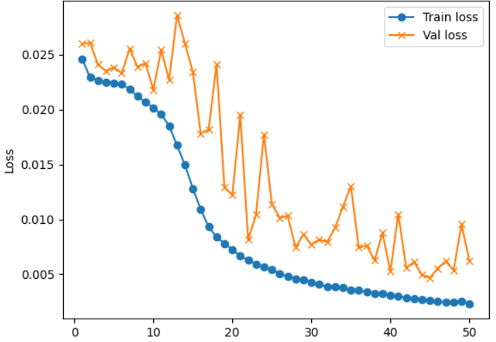

# Facial Emotion Recognition (FER)

This project aims to recognize facial expressions using the **FER2013Plus** dataset, which includes an additional **pain** class. The model architecture is designed to capture a range of emotions with high accuracy, leveraging advanced blocks like **CBAM (Convolutional Block Attention Module)** and **SE (Squeeze and Excitation)**. 

The dataset contains images labeled with 6 classes of facial expressions: **happy, sad, neutral, surprise, fear, disgust**, and the additional **pain** class. The model was trained with a custom loss function combining **ArcFace Loss** and **Center Loss** to improve facial feature discrimination.

## Model Architecture

The architecture is a convolutional neural network (CNN) with multiple convolutional layers, CBAM blocks, and a final fully connected layer for classification. Below is a breakdown of the architecture:

| **Type/Stride**  | **Filter Shape**       | **Input Size**   |
|------------------|------------------------|------------------|
| Conv/s2          | 3×3×3×32               | 224×224×3        |
| Conv dw/s1       | 3×3×32 dw              | 112×112×32       |
| Conv/s1          | 1×1×32×64              | 112×112×32       |
| Conv dw/s2       | 3×3×64 dw              | 112×112×64       |
| Conv/s1          | 1×1×64×128             | 56×56×64         |
| Conv dw/s1       | 3×3×128 dw             | 56×56×128        |
| Conv/s1          | 1×1×128×128            | 56×56×128        |
| Conv dw/s2       | 3×3×128 dw             | 56×56×128        |
| Conv/s1          | 1×1×128×256            | 28×28×128        |
| **CBAM**         | Channel Attention, Spatial Attention | 28×28×256 |
| Conv dw/s1       | 3×3×256 dw             | 28×28×256        |
| Conv/s1          | 1×1×256×256            | 28×28×256        |
| Conv dw/s2       | 3×3×256 dw             | 28×28×256        |
| Conv/s1          | 1×1×256×512            | 14×14×256        |
| **CBAM**         | Channel Attention, Spatial Attention | 14×14×512 |
| Conv dw/s1       | 3×3×512 dw             | 14×14×512        |
| Conv/s1          | 1×1×512×512            | 14×14×512        |
| **CBAM**         | Channel Attention, Spatial Attention | 14×14×512 |
| Conv dw/s2       | 3×3×512 dw             | 14×14×512        |
| Conv/s1          | 1×1×512×1024           | 7×7×512          |
| Conv dw/s1       | 3×3×1024 dw            | 7×7×1024         |
| Conv/s1          | 1×1×1024×1024          | 7×7×1024         |
| **CBAM**         | Channel Attention, Spatial Attention | 7×7×1024 |
| Avg Pool/s1      | Pool 7×7                | 7×7×1024         |
| FC/s1            | 1024×7                 | 1×1×1024         |
| Softmax          | Classifier             | 1×1×7            |

- **Conv dw**: Depthwise Convolution
- **CBAM**: Convolutional Block Attention Module
- **SE Block**: Squeeze and Excitation Block
- **Softmax**: Output layer for classification into 7 emotion classes

## Custom Loss Function
The model uses a combination of two custom loss functions:
- **ArcFace Loss**: Helps to improve facial feature discrimination by adding angular margins between classes.
- **Center Loss**: Minimizes intra-class variance and helps the model learn more compact class centers.

## Results
The model was trained on the **FER2013Plus** dataset, which includes facial images labeled with 7 emotion categories. The results below show the **training loss** and **accuracy** over multiple epochs.

# Training Loss

# Accuracy

# Confusion Matrix

# Results on Unseen Images

You can access model files in the repository.

## Dataset
The dataset used for this project is available in the kaggle repository. It contains 7 classes of facial expressions, with the newly added **pain** class. You can find the dataset [[here]](https://www.kaggle.com/datasets/bakhtawartariq/dataset1)

---

